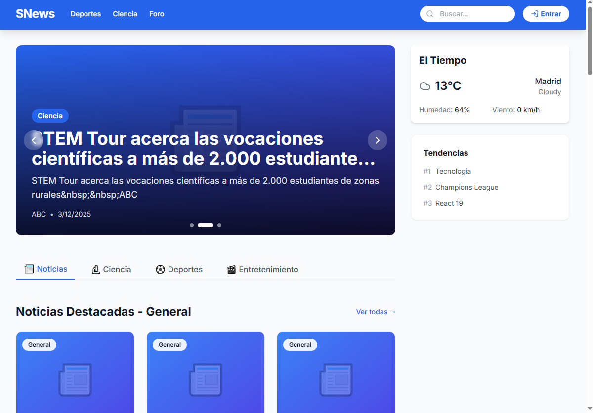
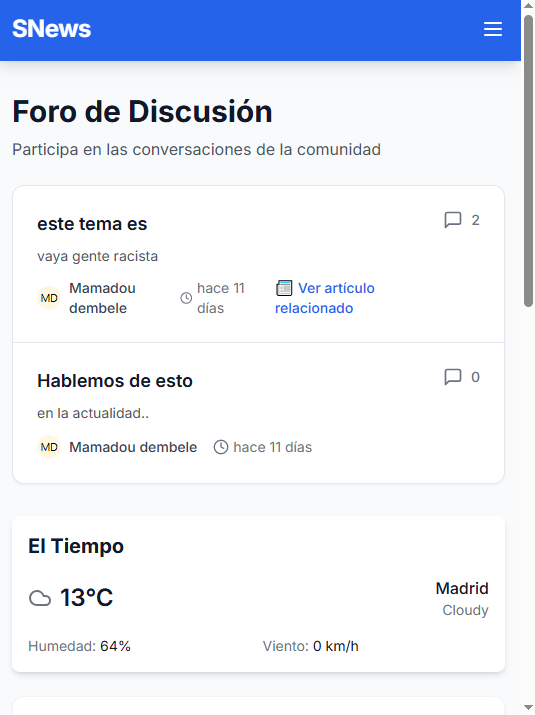
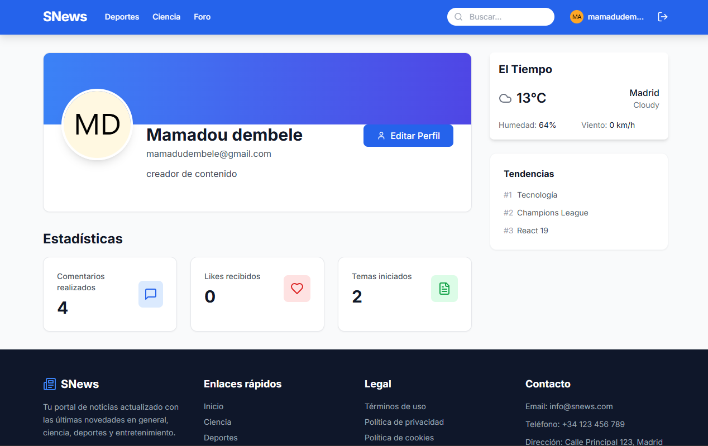

# 📰 SNews - Social News & Interactive Forum


**SNews** es una aplicación web Full Stack moderna que centraliza el consumo de noticias y fomenta la interacción social. Combina la agilidad de una SPA en **React**, la robustez de una API en **Laravel** y la potencia en la nube de **Supabase**.

---

## 🚀 Tecnologías (Tech Stack)

### Frontend
-    **React 19** + **Vite**
-    **Tailwind CSS 4**
-   **Axios** (Con interceptores JWT)
-   **React Router DOM**

### Backend
-    **Laravel 11** (API REST)
-    **PHP 8.3**
-   **Guzzle HTTP** (Consumo de APIs externas)
-   **Custom Guards** (Validación de Tokens Supabase)

### Base de Datos & Servicios
-    **Supabase** (PostgreSQL + Auth)
-   **Google News** (Fuentes RSS)
-   **Open-Meteo** (API Meteorológica)

---

## 🏛️ Arquitectura del Proyecto

Este proyecto utiliza una arquitectura **Híbrida Desacoplada**:

1.  **Frontend como "Dueño" de la Sesión:** React gestiona la autenticación directamente con Supabase Auth.
2.  **Backend Stateless:** Laravel actúa como una API pura. No gestiona sesiones de navegador. Valida cada petición verificando la firma del JWT (JSON Web Token) de Supabase.
3.  **Sincronización de Datos:** Al registrarse un usuario, se mantiene la integridad referencial sincronizando `auth.users` (Supabase) con una tabla `public.users` local para relaciones SQL complejas.

---

## ✨ Funcionalidades Principales

### 1. 🌍 Portal de Noticias
-   **Ingesta Automática:** Comando Artisan (`php artisan rss:import`) que extrae noticias de Google News (General, Ciencia, Deportes, Entretenimiento).
-   **Filtrado:** Navegación por categorías dinámica.

### 2. 💬 Foro Interactivo
-   **Creación de Temas:** Los usuarios pueden iniciar debates.
-   **Comentarios Anidados (Deep Nesting):** Sistema recursivo que permite responder a respuestas infinitamente (tipo Reddit/YouTube).
-   **Likes:** Sistema de interacción positivo con actualización optimista en la UI.

### 3. 🌤️ Módulo Meteorológico
-   **Widget Inteligente:** Detecta la ciudad o usa Madrid por defecto.
-   **Predicción Detallada:** Página dedicada `/weather` con gráficas por horas y pronóstico a 7 días.
-   **Caché en DB:** Optimización mediante tabla `weather_reports` para minimizar llamadas a la API externa (TTL 1 hora).

### 4. 👤 Gestión de Perfil
-   **Dashboard:** Estadísticas personales (comentarios realizados, likes recibidos, temas creados).
-   **Edición:** Posibilidad de modificar avatar, biografía y nombre.

---

## 🛠️ Instalación y Configuración Local

### Prerrequisitos
-   Node.js & NPM
-   PHP 8.2+ & Composer
-   Cuenta en Supabase

### Paso 1: Configuración del Backend (Laravel)

1.  Clonar el repositorio y entrar a la carpeta del servidor:
    ```bash
    cd backend
    composer install
    ```
2.  Configurar variables de entorno:
    ```bash
    cp .env.example .env
    php artisan key:generate
    ```
3.  Editar `.env` con tus credenciales de Supabase:
    ```ini
    DB_CONNECTION=pgsql
    DB_HOST=aws-0-eu-central-1.pooler.supabase.com # Tu Connection Pooler
    DB_PORT=6543
    DB_DATABASE=postgres
    DB_USERNAME=postgres.turoyecto
    DB_PASSWORD=tu_password_db
    
    SUPABASE_JWT_SECRET=tu_jwt_secret_largo_de_supabase_settings
    ```
4.  Ejecutar migraciones (o usar el script SQL proporcionado en `database/schema.sql` en el panel de Supabase):
    ```bash
    php artisan migrate
    ```
5.  Poblar noticias iniciales:
    ```bash
    php artisan rss:import
    ```
6.  Levantar servidor:
    ```bash
    php artisan serve
    ```

### Paso 2: Configuración del Frontend (React)

1.  Entrar a la carpeta del cliente:
    ```bash
    cd frontend
    npm install
    ```
2.  Crear archivo `.env`:
    ```ini
    VITE_API_URL=http://localhost:8000/api
    VITE_SUPABASE_URL=https://tu-proyecto.supabase.co
    VITE_SUPABASE_ANON_KEY=tu_anon_key_publica
    ```
3.  Levantar cliente:
    ```bash
    npm run dev
    ```

---

## 🧪 Testing

El proyecto incluye una colección de pruebas para validar la API.

### Endpoints Principales
| Método | Endpoint | Descripción | Auth |
| :--- | :--- | :--- | :--- |
| `GET` | `/api/articles` | Listado de noticias | ❌ |
| `GET` | `/api/topics` | Listado del foro | ❌ |
| `GET` | `/api/weather` | Datos del clima | ❌ |
| `GET` | `/api/profile` | Datos y stats del usuario | ✅ |
| `POST` | `/api/comments` | Publicar comentario | ✅ |

---

## 📸 Capturas de Pantalla

| Home Page | Foro de Discusión |
| :---: | :---: |
|  |  |

| Detalle Noticia | Perfil de Usuario |
| :---: | :---: |
|  |  |

---

## 📄 Licencia

Este proyecto es de código abierto y está disponible bajo la [Licencia MIT](LICENSE).

---

Desarrollado por **[Mamadou Cellou Dembele Diallo]** como Trabajo de Fin de Grado (TFG) - 2025.
